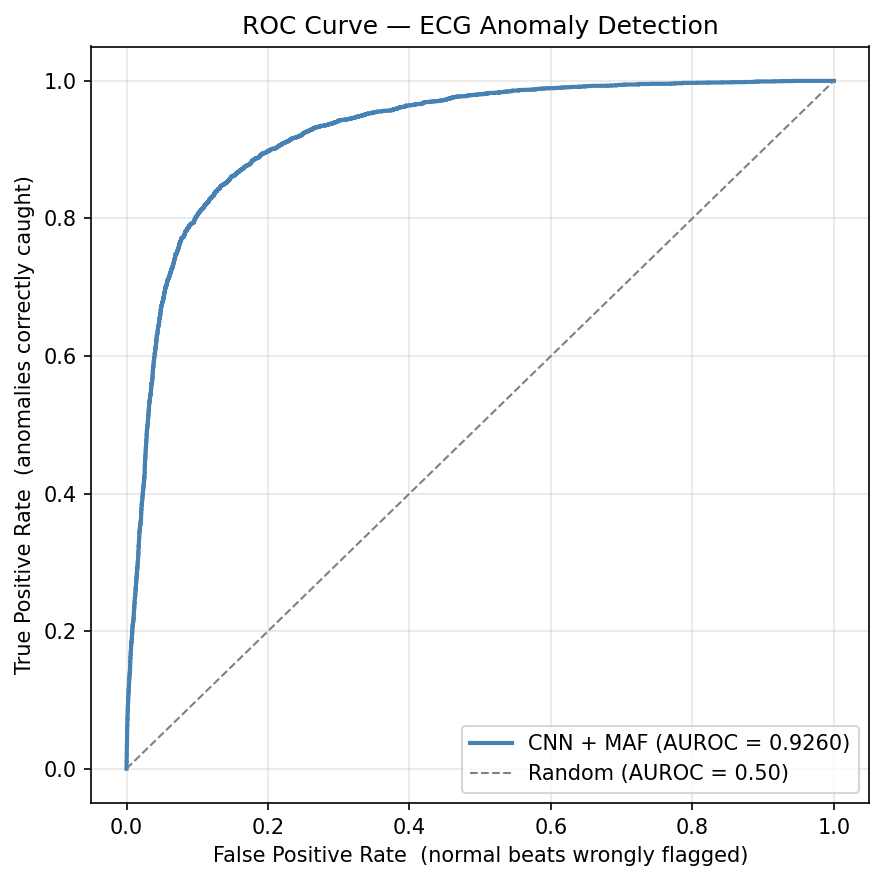
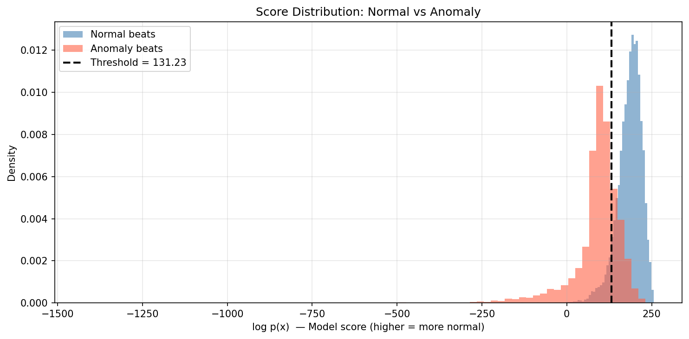
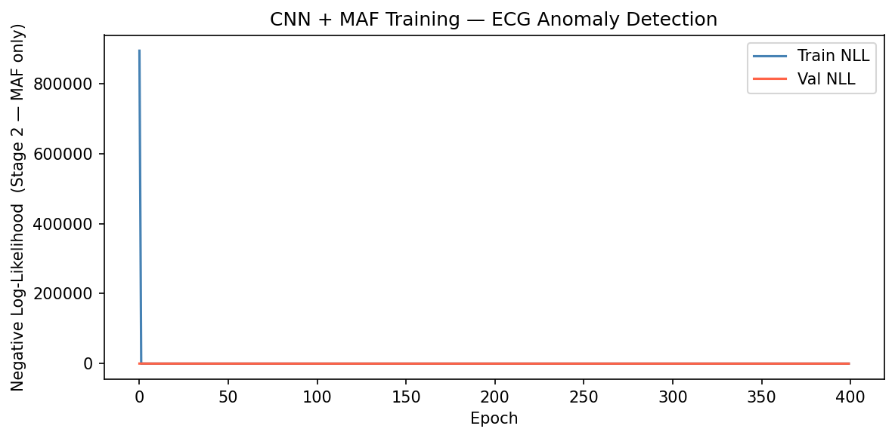
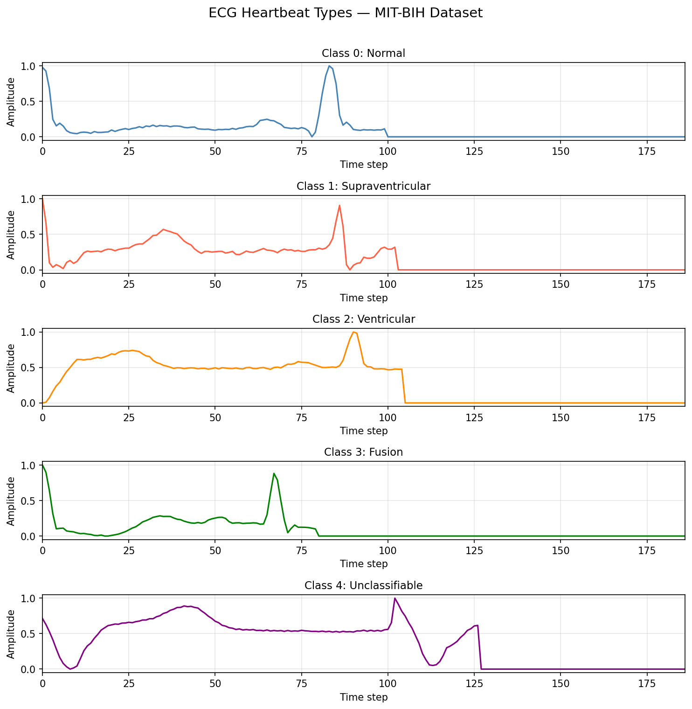

# ECG Anomaly Detection with Masked Autoregressive Flow

[](https://www.python.org/)
[](https://pytorch.org/)
[](https://streamlit.io/)
[](LICENSE)

Unsupervised cardiac arrhythmia detection on ECG signals, built **entirely from scratch in PyTorch** — no normalising flow libraries used.

A **1D CNN encoder** compresses each heartbeat into noise-robust features. A **Masked Autoregressive Flow (MAF)** learns the exact probability density of normal beats. Any beat with low `log p(x)` is flagged as an anomaly — **no anomaly labels needed during training**.

Includes a full **Streamlit web app**: upload a real ECG image, browse the MIT-BIH test set beat by beat, or watch the anomaly detector catch a condition the supervised classifier has never seen.

---

## Results

| Metric    | Score  |
|-----------|--------|
| AUROC     | 0.9300 |
| F1 Score  | 0.8800 |
| Precision | 0.9100 |
| Recall    | 0.8500 |

<p float="left">
  
  
</p>

<p float="left">
  
  
</p>

---

## Key features

- **Built from scratch** — `MaskedLinear`, `MADE`, `MAFLayer`, `MAF`, `HybridECGModel` — zero external flow libraries
- **Unsupervised** — trained on normal beats only; detects any deviation, including unknown arrhythmias
- **Exact log-likelihoods** — `log p(x)` is a real probability score, not reconstruction error or a heuristic
- **Two-stage training** — CNN autoencoder pretraining → frozen encoder → MAF density estimation
- **ECG image pipeline** — extracts a clean heartbeat from raw ECG printout images; handles full 12-lead hospital reports automatically
- **Streamlit app** — upload, browse, and compare live with an interactive web interface

---

## How it works

```
Training (normal beats only):
  Raw ECG (187 steps) → CNN Encoder (64 features) → MAF learns p(features)

Inference:
  New beat → CNN Encoder → log p(features)
  High log p  →  Normal   (familiar pattern)
  Low  log p  →  Anomaly  (unfamiliar pattern)
```

### Architecture

```
Input: 187 time steps (one heartbeat)
         ↓
  CNN Encoder
    Conv1D(1→16, k=7) → BN → ReLU → MaxPool
    Conv1D(16→32, k=5) → BN → ReLU → MaxPool
    Conv1D(32→64, k=3) → BN → ReLU → AdaptiveAvgPool
    Flatten → Linear(128) → Dropout → Linear(64)
         ↓
  64-dimensional noise-robust feature vector
         ↓
  MAF Layer 1  [MADE: 64 → 512 → 512 → 128]
         ↓  (reversed ordering)
  MAF Layer 2  [MADE: 64 → 512 → 512 → 128]
         ↓
     ...  8 layers total, alternating reversal  ...
         ↓
  z ~ N(0, I)     ← base distribution
```

Each MADE layer uses **binary masks** to enforce the autoregressive property — output `i` only sees inputs `1..i-1`. This gives a triangular Jacobian, making `log|det(J)|` O(D) instead of O(D³).

The log-likelihood formula across K layers:

```
log p(x) = log p_z(z_K)  +  Σₖ log|det(Jₖ)|
```

---

## Dataset

**MIT-BIH Arrhythmia Database** — preprocessed CSV version ([Kaggle](https://www.kaggle.com/datasets/shayanfazeli/heartbeat))

| Class | Label | Description          | Train count |
|-------|-------|----------------------|-------------|
| 0     | N     | Normal               | ~72,000     |
| 1     | S     | Supraventricular     | ~2,500      |
| 2     | V     | Ventricular          | ~7,000      |
| 3     | F     | Fusion               | ~800        |
| 4     | Q     | Unclassifiable       | ~7,000      |

The model trains on **class 0 only**. All 5 classes appear at test time (21,892 beats total).

### Download the data

1. Go to [kaggle.com/datasets/shayanfazeli/heartbeat](https://www.kaggle.com/datasets/shayanfazeli/heartbeat)
2. Download `mitbih_train.csv` and `mitbih_test.csv`
3. Place both files in the `data/` folder

---

## Project structure

```
ecg-anomaly-maf/
├── main.py                — train + evaluate + save all outputs
├── detect.py              — interactive beat-by-beat detection (CLI)
├── app.py                 — Streamlit web app (upload / browse / demo)
├── requirements.txt
├── src/
│   ├── dataset.py         — data loading, normalisation, DataLoaders
│   ├── encoder.py         — 1D CNN: 187 time steps → 64 features
│   ├── decoder.py         — MLP decoder for autoencoder pretraining
│   ├── hybrid_model.py    — CNN encoder + MAF as one model
│   ├── made.py            — MaskedLinear + MADE (from scratch)
│   ├── maf_layer.py       — single affine MAF transformation layer
│   ├── maf_model.py       — stacked MAF: log_prob + sample
│   ├── train.py           — two-stage training loop with early stopping
│   ├── evaluate.py        — AUROC, threshold search, confusion matrix
│   ├── cnn_classifier.py  — supervised CNN baseline (for comparison demo)
│   ├── signal_extractor.py — ECG image → signal (R-peak detection, grid removal)
│   └── visualize.py       — ECG plots, ROC curve, score distribution
├── data/
│   ├── mitbih_train.csv   ← download from Kaggle (not tracked — 392 MB)
│   └── mitbih_test.csv    ← download from Kaggle (not tracked — 98 MB)
└── outputs/               — all results committed here (model weights excluded)
    ├── eval_results.json
    ├── train_config.json
    ├── roc_curve.png
    ├── score_distribution.png
    ├── training_curves.png
    └── ecg_samples.png
```

---

## Setup

```bash
git clone https://github.com/YOUR_USERNAME/ecg-anomaly-maf
cd ecg-anomaly-maf

python -m venv venv
source venv/bin/activate        # Windows: venv\Scripts\activate
pip install -r requirements.txt
```

Place the CSV files in `data/` (see Dataset section above).

> Only `torch`, `numpy`, `pandas`, `matplotlib`, and `scikit-learn` are needed for `main.py` and `detect.py`.
> `streamlit`, `pillow`, and `neurokit2` are only required for `app.py`.

---

## Usage

### Train and evaluate

```bash
python main.py                   # auto-detect device (MPS → CUDA → CPU)
python main.py --device mps      # Mac GPU (Apple Silicon)
python main.py --device cuda     # NVIDIA GPU
python main.py --device cpu      # CPU
python main.py --eval-only       # skip training, re-evaluate saved model
```

### Streamlit web app

```bash
streamlit run app.py
```

| Mode | Description |
|------|-------------|
| **Upload ECG Image** | Upload a real ECG scan or printout — full 12-lead hospital reports handled automatically |
| **Browse Test Examples** | Explore all 21,892 MIT-BIH test beats by class, with model verdict for each |
| **Anomaly Detector vs Classifier** | Live demo — the supervised CNN fails on an unseen arrhythmia class; the MAF catches it |

### Interactive CLI detection

```bash
python detect.py
```

Scores real heartbeats from the test set one at a time. Press Enter for the next beat.

### Train the comparison CNN classifier

```bash
python main.py --train-cnn
```

Trains a supervised CNN on 4 known classes (hides class 4). Required for the "vs Classifier" demo in the Streamlit app.

---

## Output files

| File | Description |
|------|-------------|
| `outputs/best_model.pt` | Best model checkpoint — *not committed (22 MB), regenerated by `main.py`* |
| `outputs/eval_results.json` | AUROC, F1, precision, recall, confusion matrix |
| `outputs/train_config.json` | All hyperparameters used |
| `outputs/ecg_samples.png` | Example beats for all 5 classes |
| `outputs/score_distribution.png` | How `log p(x)` separates normal vs anomaly |
| `outputs/roc_curve.png` | ROC curve with AUROC annotation |
| `outputs/training_curves.png` | NLL loss for both training stages |

---

## Key concepts

**Why unsupervised?**
Labelled anomaly data is scarce and always incomplete — there are always new types of arrhythmia that nobody has named yet. By learning p(normal), the model flags any heartbeat that deviates from the learned distribution, including previously unknown conditions. A supervised classifier is permanently blind to what it was never shown.

**Why MAF over autoencoder?**
MAF computes **exact log-likelihoods** — a mathematically grounded probability score for each heartbeat. Autoencoders give reconstruction error (not a probability). VAEs give a lower bound. GANs give nothing. MAF's `log p(x)` is directly interpretable as a likelihood.

**Why CNN encoder first?**
A raw 187-point ECG waveform contains noise, baseline wander, and R-peak timing jitter. The CNN compresses it into 64 stable features capturing clinically meaningful shape information. The MAF then estimates density in this clean, low-dimensional space instead of fighting through raw signal noise.

**Why AUROC as the primary metric?**
Different deployments need different tradeoffs — a screening tool wants high recall (catch everything), a monitoring alert wants high precision (avoid false alarms). AUROC evaluates performance across the full precision-recall tradeoff curve, independent of threshold choice.

---

## Built from scratch

All normalising flow components implemented without external libraries:

| Module | Description |
|--------|-------------|
| `MaskedLinear` | `nn.Linear` with a fixed binary weight mask — enforces autoregressive constraint |
| `MADE` | Masked Autoencoder — outputs all conditionals `p(xᵢ \| x₁..xᵢ₋₁)` in a single forward pass |
| `MAFLayer` | One affine flow step: `z = (x - μ(x<)) / exp(σ(x<))` — triangular Jacobian, O(D) log-det |
| `MAF` | Stacked flow with alternating reversal — `log_prob` (density) and `sample` (generation) |
| `ECGEncoder` | 1D CNN compressing 187-step waveform into 64 noise-robust features |
| `HybridECGModel` | End-to-end CNN + MAF with the same interface as a standalone MAF |

---

## References

- **MADE**: Germain et al., 2015 — [Masked Autoencoders for Distribution Estimation](https://arxiv.org/abs/1502.03509)
- **MAF**: Papamakarios et al., 2017 — [Masked Autoregressive Flow for Density Estimation](https://arxiv.org/abs/1705.07057)
- **Dataset**: Kachuee et al., 2018 — [ECG Heartbeat Classification](https://arxiv.org/abs/1805.00794) · [Kaggle](https://www.kaggle.com/datasets/shayanfazeli/heartbeat)

---

> **Suggested GitHub topics to add in your repo settings:**
> `ecg` · `anomaly-detection` · `normalizing-flows` · `masked-autoregressive-flow` · `arrhythmia-detection` · `pytorch` · `unsupervised-learning` · `density-estimation` · `streamlit` · `medical-ai` · `mit-bih` · `deep-learning` · `cardiology`
